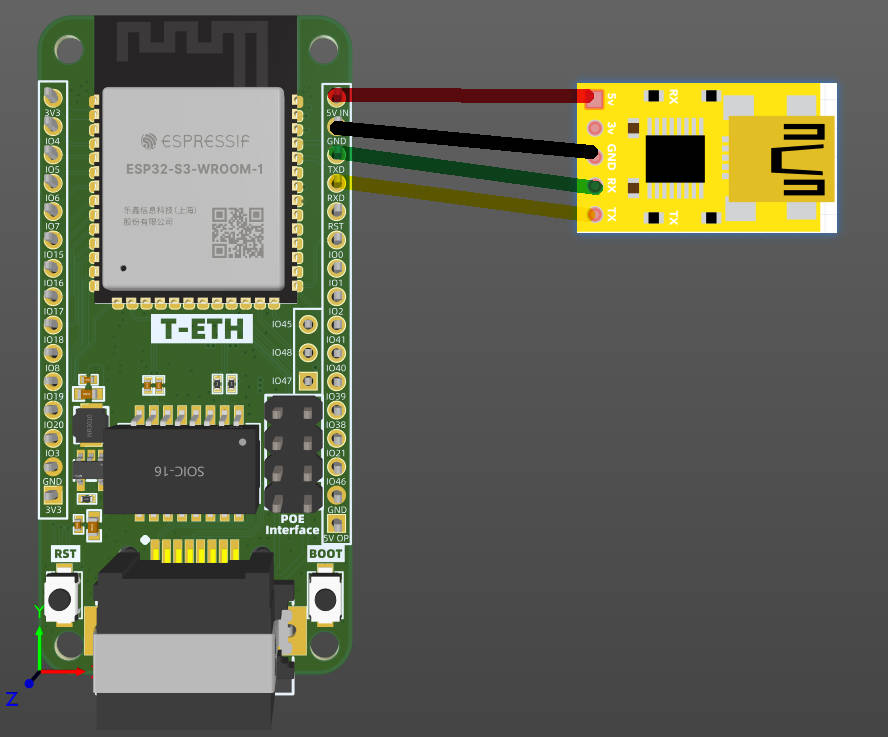

<h1 align = "center">🌟LilyGO T-ETH-Series</h1>

<!-- ### PlatformIO Build Status -->
[](https://github.com/Xinyuan-LilyGO/LilyGO-T-ETH-Series/actions/workflows/Build-T-INTERNET-COM.yml)
[](https://github.com/Xinyuan-LilyGO/LilyGO-T-ETH-Series/actions/workflows/Build-T-ETH-POE.yml)
[](https://github.com/Xinyuan-LilyGO/LilyGO-T-ETH-Series/actions/workflows/Build-T-ETH-POE-PRO.yml)
[](https://github.com/Xinyuan-LilyGO/LilyGO-T-ETH-Series/actions/workflows/Build-T-ETH-Lite-ESP32-S3.yml)
[](https://github.com/Xinyuan-LilyGO/LilyGO-T-ETH-Series/actions/workflows/Build-T-ETH-Lite-ESP32.yml)
[](https://github.com/Xinyuan-LilyGO/LilyGO-T-ETH-Series/actions/workflows/Build-T-ETH-ELite-ESP32-S3.yml)

<!-- ### Arduino IDE Build Status -->
[](https://github.com/Xinyuan-LilyGO/LilyGO-T-ETH-Series/actions/workflows/Build-ArduinoIDE-T-INTERNET-COM.yml)
[](https://github.com/Xinyuan-LilyGO/LilyGO-T-ETH-Series/actions/workflows/Build-ArduinoIDE-T-ETH-POE.yml)
[](https://github.com/Xinyuan-LilyGO/LilyGO-T-ETH-Series/actions/workflows/Build-ArduinoIDE-T-ETH-POE-PRO.yml)
[](https://github.com/Xinyuan-LilyGO/LilyGO-T-ETH-Series/actions/workflows/Build-ArduinoIDE-T-ETH-Lite-ESP32S3.yml)
[](https://github.com/Xinyuan-LilyGO/LilyGO-T-ETH-Series/actions/workflows/Build-T-ETH-Lite-ESP32.yml)
[](https://github.com/Xinyuan-LilyGO/LilyGO-T-ETH-Series/actions/workflows/Build-ArduinoIDE-T-ETH-ELite-ESP32S3.yml)

<!-- **English | [中文](README_CN.MD)** -->

## News:

* For esp-arduino versions lower than [3.0.0](https://github.com/espressif/arduino-esp32/releases/tag/3.0.0-rc1), use ETHClass2 as the driver. For versions higher than [2.x](https://github.com/espressif/arduino-esp32/releases/tag/2.0.15), esp-arduino native ETHClass will be used. It is recommended to use arduino-esp 3.0.0 and above


## Product:

| Product(PinMap)                       | SOC                                   | Flash | PSRAM     | Ethernet | POE      | SDCard |
| ------------------------------------- | ------------------------------------- | ----- | --------- | -------- | -------- | ------ |
| [T-Internet-POE][1]                   | ESP32-WROOM-32                        | 4MB   | ❌         | LAN8720  | ✅        | ✅      |
| [T-POE-PRO][2]                        | ESP32-WROVER-E                        | 16MB  | 8MB(QSPI) | LAN8720  | ✅        | ❌      |
| [T-INTER-COM][3]                      | ESP32-WROVER-E                        | 16MB  | 8MB(QSPI) | LAN8720  | ❌        | ✅      |
| [T-ETH-Lite-ESP32][4]                 | ESP32-WROVER-E                        | 16MB  | 8MB(QSPI) | RTL8201  | (Option) | ✅      |
| [T-ETH-Lite-ESP32S3][5]               | ESP32-S3-WROOM-1                      | 16MB  | 8MB(OPI)  | W5500    | (Option) | ✅      |
| [T-ETH-Lite-POE-Shield][6]            | POE Shield (IEEE802.3 af/Class 0)     |       |           |          |          |        |
| [T-ETH-Lite-ESP32S3-Camera-Shield][6] | Camera Shield (Support OV2640/OV5640) |       |           |          |          |        |
| [T-ETH-ELite-ESP32S3][7]              | ESP32-S3-WROOM-1                      | 16MB  | 8MB(OPI)  | W5500    | ✅        | ✅      |

[1]: https://www.lilygo.cc/products/t-internet-poe
[2]: https://www.lilygo.cc/products/t-poe-pro
[3]: https://www.lilygo.cc/products/t-internet-com
[4]: https://www.lilygo.cc/products/t-eth-lite?variant=43120880746677
[5]: https://www.lilygo.cc/products/t-eth-lite?variant=43120880779445
[6]: https://www.lilygo.cc/products/t-eth-lite?variant=43120887038133
[7]: https://www.lilygo.cc/products

## Examples

```bash
examples/
├── UnitTestExample                         # Board function example
├── ETHOTA                                  # Upgrade firmware via Ethernet
├── HelloServer                             # WebServer using ETH
├── SDWebServer                             # SDWebServer using ETH
├── MQTTClient                              # MQTT Example
├── ESPMQTTSClient                          # MQTTS Example
├── StaticIPAddress                         # Example of static IP address
├── UDPClientReceiver                       # UDP Receiver example
├── UDPClientSender                         # UDP Sender example
├── UDPClientReceiverDirectPC               # UDP Receiver, Directly connect to PC using network cable
├── UDPClientSenderDirectPC                 # UDP Sender, Directly connect to PC using network cable
├── AsyncUDPClient                          # Async UDP Client
├── AsyncUDPServer                          # Async UDP Sender
├── WebSocketClient                         # WebSocket Client
├── WebSocketServer                         # WebSocket Server
├── UnitTestExample                         # Hardware test example
├── TCPClient                               # TCP Client
├── TCPServer                               # TCP Server
├── RS485_Master                            # RS485 Sender (ETH-Pro only)
├── RS485_Slave                             # RS485 Receiver (ETH-Pro only)
├── RS485_ModBUS                            # RS485 Modbus Master (ETH-Pro only)
├── TFT_ILI9341_Shield                      # Screen interface example (ETH-Pro/ETH-Lite-ESP32 only)
├── CameraShield                            # Camera shield example (ETH-Lite-ESP32S3 only)
├── LoRaShield                              # LoRa Shield Sender Example (ETH-PRO only)
├── SPIExample                              # SPI initialization example (ETH-PRO only)
├── SPI_Wire_DevicesExample                 # SPI bus & Wire sharing example  (ETH-PRO only)
├── SharingSPIBus                           # SPI bus sharing example
├── InternetComTest                         # T-INTER-COM example (T-INTER-COM only)
├── WireExample                             # Wire initialization example
├── USB_Camera                              # USB camera example (Only ESP32S3)
├── I2C_HP303BSensor                        # External I2C Temperature and Humidity Sensor Example
├── I2C_BME280Sensor                        # External I2C Temperature and Humidity Sensor Example
├── TinyGPS_Example                         # GPS Module example 
├── PCIE_Modem_ATDebug                      # PCIE Modem example
├── ADC_Button                              # ADC button example
└── T-ETH-ELite-Shield                      # T-ETH-Elite Dedicated examples
    ├── LoRa_Receive_Interrupt              # T-ETH-Elite Dedicated examples - LoRa Shield example
    ├── LoRa_Transmit_Interrupt             # T-ETH-Elite Dedicated examples - LoRa Shield example
    ├── T-ETH-Elite-Gateway-Shield          # T-ETH-Elite Dedicated examples - Gateway Shield test example
    ├── T-ETH-Elite-LTE-Shield              # T-ETH-Elite Dedicated examples - LTE Shield test example
    └── T-ETH-Elite-LoRa-Shield             # T-ETH-Elite Dedicated examples - LoRa Shield factory example
```

| Examples                  | [T-Internet-POE][1] | [T-POE-PRO][2]    | [T-INTER-COM][3] | [T-ETH-Lite-ESP32][4] | [T-ETH-Lite-ESP32S3][5] | [T-ETH-ELite-ESP32S3][5] |
| ------------------------- | ------------------- | ----------------- | ---------------- | --------------------- | ----------------------- | ------------------------ |
| UnitTestExample           | ✅                   | ✅                 | ✅                | ✅                     | ✅                       | ✅                        |
| ETHOTA                    | ✅                   | ✅                 | ✅                | ✅                     | ✅                       | ✅                        |
| HelloServer               | ✅                   | ✅                 | ✅                | ✅                     | ✅                       | ✅                        |
| SDWebServer               | ✅                   | ✅                 | ✅                | ✅                     | ✅                       | ✅                        |
| MQTTClient                | ✅                   | ✅                 | ✅                | ✅                     | ✅                       | ✅                        |
| ESPMQTTSClient            | ✅                   | ✅                 | ✅                | ✅                     | ✅                       | ✅                        |
| StaticIPAddress           | ✅                   | ✅                 | ✅                | ✅                     | ✅                       | ✅                        |
| UDPClientReceiver         | ✅                   | ✅                 | ✅                | ✅                     | ✅                       | ✅                        |
| UDPClientSender           | ✅                   | ✅                 | ✅                | ✅                     | ✅                       | ✅                        |
| UDPClientReceiverDirectPC | ✅                   | ✅                 | ✅                | ✅                     | ✅                       | ✅                        |
| UDPClientSenderDirectPC   | ✅                   | ✅                 | ✅                | ✅                     | ✅                       | ✅                        |
| AsyncUDPClient            | ✅                   | ✅                 | ✅                | ✅                     | ✅                       | ✅                        |
| AsyncUDPServer            | ✅                   | ✅                 | ✅                | ✅                     | ✅                       | ✅                        |
| WebSocketClient           | ✅                   | ✅                 | ✅                | ✅                     | ✅                       | ✅                        |
| WebSocketServer           | ✅                   | ✅                 | ✅                | ✅                     | ✅                       | ✅                        |
| TCPClient                 | ✅                   | ✅                 | ✅                | ✅                     | ✅                       | ✅                        |
| TCPServer                 | ✅                   | ✅                 | ✅                | ✅                     | ✅                       | ✅                        |
| InternetComTest           | ❌   (Can't run)     | ❌   (Can't run)   | ✅                | ❌   (Can't run)       | ❌   (Can't run)         | ❌   (Can't run)          |
| RS485_Master              | ❌   (Not adapted)   | ✅                 | ❌   (Can't run)  | ❌   (Not adapted)     | ❌   (Not adapted)       | ❌   (Not adapted)        |
| RS485_Slave               | ❌   (Not adapted)   | ✅                 | ❌   (Can't run)  | ❌   (Not adapted)     | ❌   (Not adapted)       | ❌   (Not adapted)        |
| RS485_ModBUS              | ❌   (Not adapted)   | ✅                 | ❌   (Can't run)  | ❌   (Not adapted)     | ❌   (Not adapted)       | ❌   (Not adapted)        |
| TFT_ILI9341_Shield        | ❌   (Can't run)     | ✅                 | ❌   (Can't run)  | ✅                     | ❌   (Not adapted)       | ❌   (Not adapted)        |
| CameraShield              | ❌   (Can't run)     | ❌   (Can't run)   | ❌   (Can't run)  | ❌   (Can't run)       | ✅                       | ✅                        |
| LoRaShield                | ✅                   | ❌   (Not adapted) | ❌   (Can't run)  | ❌   (Not adapted)     | ❌   (Not adapted)       | ❌   (Not adapted)        |
| SPIExample                | ✅                   | ✅                 | ❌   (Can't run)  | ✅                     | ✅                       | ✅                        |
| SPI_Wire_DevicesExample   | ✅                   | ❌   (Not adapted) | ❌   (Can't run)  | ✅                     | ❌   (Not adapted)       | ❌   (Not adapted)        |
| SharingSPIBus             | ✅                   | ❌   (Not adapted) | ❌   (Can't run)  | ❌   (Not adapted)     | ❌   (Not adapted)       | ❌   (Not adapted)        |
| WireExample               | ✅                   | ✅                 | ❌   (Can't run)  | ✅                     | ✅                       | ✅                        |
| USB_Camera                | ❌   (Can't run)     | ❌   (Can't run)   | ❌   (Can't run)  | ❌   (Can't run)       | ✅                       | ✅                        |
| I2C_HP303BSensor          | ✅                   | ✅                 | ❌   (Can't run)  | ✅                     | ✅                       | ✅                        |
| TinyGPS_Example           | ✅                   | ✅                 | ❌   (Can't run)  | ✅                     | ✅                       | ✅                        |
| PCIE_Modem_ATDebug        | ❌   (Not adapted)   | ❌   (Not adapted) | ✅                | ❌   (Not adapted)     | ✅                       | ✅                        |
| ADC_Button                | ✅                   | ✅                 | ❌   (Can't run)  | ✅                     | ✅                       | ✅                        |

## 1️⃣ PlatformIO Quick Start <Recommended>

1. Install [Visual Studio Code](https://code.visualstudio.com/) and [Python](https://www.python.org/)
2. Search for the `PlatformIO` plugin in the `VisualStudioCode` extension and install it.
3. After the installation is complete, you need to restart `VisualStudioCode`
4. After restarting `VisualStudioCode`, select `File` in the upper left corner of `VisualStudioCode` -> `Open Folder` -> select the `LilyGO T-ETH-Series` directory
5. Wait for the installation of third-party dependent libraries to complete
6. Click on the `platformio.ini` file, and in the `platformio` column
7. First change the default_envs to the board used
8. Uncomment one of the lines src_dir = xxxx to make sure only one line works
9. Click the (✔) symbol in the lower left corner to compile
10. Connect the board to the computer USB (If there is no onboard downloader, USB2TTL must be connected)
11. Click (→) to upload firmware
12. Click (plug symbol) to monitor serial output
13. Since **T-LITE-ESP32** uses **IO0** as the clock input, the default working level of **DTR** is high level, so after the download is completed, you need to remove the connection between **DTR** and **IO0**, so that ETH will work, otherwise the initialization will fail
14. For **T-LITE-ESP32**, when uploading a sketch, you need to press and hold the *BOOT* button to run the upload


## 2️⃣ Arduino IDE Quick Start
* It is recommended to use platformio without cumbersome steps
1. Install [Arduino IDE](https://www.arduino.cc/en/software)
2. Install [Arduino ESP32](https://docs.espressif.com/projects/arduino-esp32/en/latest/)
3. Copy everything from this repository [lib folder](./lib/)  to Arduino library folder (e.g. C:\Users\YourName\Documents\Arduino\libraries)
4. Open ArduinoIDE -> Tools
   
5. `T-ETH-Elite` options are the same as `T-ETH-Lite`, but you need to adjust `USB CDC On Boot` to `Enabled`
5. Open the [examples](./examples/),such as [examples/UnitTestExample](./examples/UnitTestExample)
6. Switch to the [utilities.h](./examples/UnitTestExample/utilities.h) file, at the top of the sketch, uncomment the definition of the board name you use , such as **LILYGO_T_INTERNET_POE**
7. Connect external [USB2TTL](https://www.amazon.com/usb-ttl-adapter/s?k=usb+to+ttl+adapter)，such as **CP2102,CP2104,CH340X**
      * Has an onboard downloader(**T-POE-Pro**)
          If the board has a USB-C, plug it directly into the USB-C, select the corresponding port, and upload.
      * no onboard downloader(**T-ETH-Lite-ESP32/T-ETH-Lite-ESP32S3/T-Internet-POE**)
          Additional USB2TTL is required to connect the board with USB2TTL
      * Connection example:


        | USB2TTL(Has DTR,RTS) | USB2TTL(NO DTR,RTS) | T-ETH-Series |
        | -------------------- | ------------------- | ------------ |
        | 5V                   | 5V                  | 5V IN        |
        | GND                  | GND                 | GND          |
        | RX                   | RX                  | TXD          |
        | TX                   | TX                  | RXD          |
        | RTS                  |                     | RST          |
        | DTR                  |                     | IO0          |

     * Connection diagram
  
        

     *  **Note that for boards that are not connected to DTR or RTS, the board must be put into download mode before uploading the sketch, otherwise the sketch cannot be uploaded.How to enter download mode, please see FAQ**
     *  **注意，对于没有连接到DTR,RTS 的板子，上传程序之前，必须先将板子置入下载模式,否则无法上传程序，如何进入下载模式，请看FAQ**


8. Select the corresponding port and click Upload <If the upload fails, View the FAQ below>
9. Since **T-LITE-ESP32** uses **IO0** as the clock input, the default working level of **DTR** is high level, so after the download is completed, you need to remove the connection between **DTR** and **IO0**, so that ETH will work, otherwise the initialization will fail
10. **T-LITE-ESP32** Since the `PHYAD` address is selected as 0, the yellow LINK light will not light up, which does not affect the use.

<h2 align = "left">5️⃣ ESP32 basic examples </h2>

* [BLE Examples](https://github.com/espressif/arduino-esp32/tree/master/libraries/BLE)
* [WiFi Examples](https://github.com/espressif/arduino-esp32/tree/master/libraries/WiFi)
* [SPIFFS Examples](https://github.com/espressif/arduino-esp32/tree/master/libraries/SPIFFS)
* [FFat Examples](https://github.com/espressif/arduino-esp32/tree/master/libraries/FFat)
* For more examples of esp32 chip functions, please refer to [arduino-esp32-libraries](https://github.com/espressif/arduino-esp32/tree/master/libraries)

<h2 align = "left">6️⃣ FAQ </h2>

1. Unable to upload sketch,Please enter the upload mode manually.
    1. Connect the board via the USB cable or connect USB2TTL
    2. Press and hold the BOOT button , While still pressing the BOOT button, press RST
    3. Release the RST
    4. Finally release the BOOT Button(The BOOT button must be released last)
    5. Upload sketch

2. Unable to verify flash chip connection
    1. Please refer to this [issue #45](https://github.com/Xinyuan-LilyGO/LilyGO-T-ETH-Series/issues/45)

## 7️⃣ RESOURCE

* [T-ETH-ELite/Lite POE Module datasheet](./datasheet/ETH-POE-DP9900M-5V.pdf)
* [T-ETH-POR POE Module datasheet](./datasheet/ETH-PRO-POE-DP5300-12V.pdf)
* [Camera model spec](./datasheet/CAMERA_SPEC.png)
