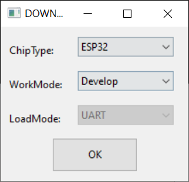
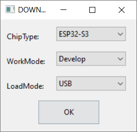
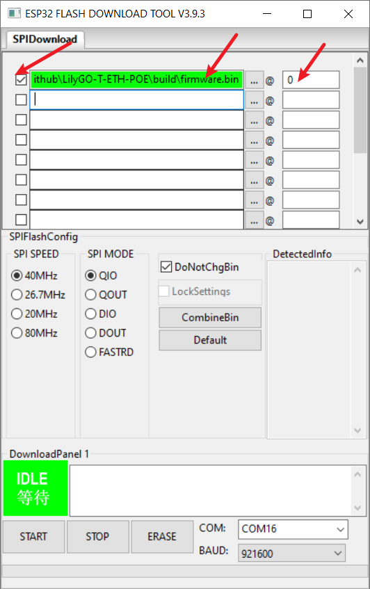
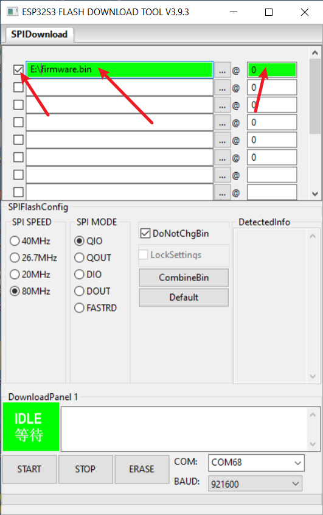

## Use ESP Download Tool

* [Flash Download Tool User Guide](https://docs.espressif.com/projects/esp-test-tools/en/latest/esp32/production_stage/tools/flash_download_tool.html)

| Steps  | ESP32 Version                   | ESP32-S3 Version                    |
| ------ | ------------------------------- | ----------------------------------- |
| Step 1 |  |  |
| Step 2 |  |  |

### Use Web Flasher

* [ESP Web Flasher Online](https://espressif.github.io/esptool-js/)


* Note that after writing is completed, you need to press RST to reset.

### Use command line

If system asks about install Developer Tools, do it.

```bash
python3 -m pip install --upgrade pip
python3 -m pip install esptool
```

In order to launch `esptool.py`, exec directly with this:

```bash
python3 -m esptool
```

For **ESP32-S3** use the following command to write

```bash
esptool --chip esp32s3  --baud 921600 --before default_reset --after hard_reset write_flash -z --flash_mode dio --flash_freq 80m 0x0 firmware.bin
```

For **ESP32** use the following command to write

```bash
esptool --chip esp32  --baud 921600 --before default_reset --after hard_reset write_flash -z --flash_mode dio --flash_freq 80m 0x0 firmware.bin
```

# 2️⃣FAQ

- **Can't upload any sketch，Please enter the upload mode manually.**
   1. Connect the board via the USB cable
   2. Press and hold the BOOT button , While still pressing the BOOT button (If there is no BOOT button, you need to use wires to connect GND and IO0 together.)
   3. Press RST button
   4. Release the RST button
   5. Release the BOOT button (If there is no BOOT button, disconnect IO0 from GND.)
   6. Upload sketch